# Architecture Plan: zen-dragon

## Summary

`zen-dragon` is a single static Go binary that merges two previously separate concerns — the ultra-fast `getdents()`-based file search (zendents) and the drag-and-drop GUI source pattern (dragon/ripdrag) — into one tool built on Gio instead of GTK. The motivation is to drop the current two-step bash workflow (`term_dragon`: shell out to a getdents-based finder, pipe results into `dragon --from-stdin`) in favor of a single process that searches and lets the user drag results out, with a virtualized list so it doesn't choke on very large directory trees (100M+ files).

## System Architecture

```mermaid
flowchart LR
    CLI["CLI: zen-dragon keyword"] --> Search["Search Engine"]

    subgraph Search ["Search Engine"]
        PureGo["unix.Getdents + parser"]
        CGo["CGo → libzendents.so"]
    end

    Search --> Channel["Result Channel chan SearchResult"]
    Channel --> Model["Bounded Ring Buffer / Streamed Model"]
    Model --> GioLoop["Gio App Loop"]

    subgraph GioLoop ["Gio App Loop"]
        VL["Virtual List (layout.List)"]
        Row["Row: checkbox + name + Copy Path/Name/Content buttons"]
        Drag["Drag Source: pointer.Filter + drag gesture"]
    end

    GioLoop --> XDnD["XDnD / Wayland data-device text/uri-list"]
    XDnD --> Target["External Target: file manager, browser, terminal"]
    CtrlA["Ctrl+A key.Filter handler"] --> GioLoop
```



The search engine and GUI communicate over a single buffered channel; the GUI never blocks on search, and search never blocks on GUI redraw.

## Component Breakdown

### `cmd/zen-dragon/main.go`
CLI entry point. Flags mirror dragon/ripdrag.

```
type Config struct {
    Root      string   // search root (default: ".")
    Keyword   string   // required
    Recursive bool     // -r
    MaxDrag   int      // max files per drag (default 100)
    Verbose   bool     // -v
}
func main()
func parseFlags() (*Config, error)
```

### `internal/search/scanner.go`
Fast directory walk via raw getdents64 syscall.

```
type SearchResult struct {
    Path  string
    Name  string
    IsDir bool
}

type Scanner interface {
    Scan(ctx context.Context, root, keyword string, out chan<- SearchResult) error
}

type GetdentsScanner struct{}     // Pure Go: unix.Getdents + linux_dirent64 parsing
type CGoScanner struct{}         // CGo: #cgo LDFLAGS: -lzendents (future)
func NewScanner(mode int) Scanner

const bufSize = 5 << 20          // 5MB buffer (same as zendents)
```

Recursion mirrors `list_dir()`: skip unreadable dirs, skip `.`/`..`, follow `-r` semantics. Cancellable via `context.Context`.

### `internal/dnd/xdnd.go`
XDnD / Wayland data-device drag-source protocol.

```
type DragSource struct {
    URIs []string
}
func (d *DragSource) OfferTypes() []string   // {"text/uri-list", "text/plain;charset=utf-8"}
func PathsToURIList(paths []string) []byte   // RFC 2483: file:// URIs joined with \r\n
func StartDrag(w *app.Window, e pointer.Event, uris []string) error
```

### `internal/gui/state.go`
App state container — persistent across frames per Gio design rules.

```
type UIState struct {
    ResultList    layout.List        // persistent scroll position
    Checked       map[string]bool    // selected files
    Results       []search.SearchResult
    ScrollSettling bool
    Config        *Config
}
```

### `internal/gui/list.go`
Virtual list + row rendering.

```
func (ui *UIState) LayoutResults(gtx C) D
func (ui *UIState) LayoutRow(gtx C, i int) D
```

Row layout: checkbox + filename + 3 buttons (Copy Path / Copy Name / Copy Content).

### `internal/gui/actions.go`
Button + clipboard + keyboard handlers.

```
func copyPath(path string) error
func copyName(path string) error
func copyContent(path string) error
func handleCtrlA(ui *UIState)
```

### `internal/gui/app.go`
Window bootstrap and event loop.

```
func RunUI(cfg *Config, results <-chan search.SearchResult) error
func setupKeyBindings(w *app.Window, ui *UIState)
```

Keybindings: `Ctrl+A` (select all), `Escape`/`q` (quit) — parity with dragon/ripdrag.

## Data Flow

1. `main.go` parses `keyword` + root path.
2. `search.Scanner.Scan()` runs in a goroutine, pushes `SearchResult` into a **bounded** channel (capacity 4096) — blocks on full channel rather than unbounded buffering (memory guard for 100M+ files).
3. A Gio-side consumer drains the channel, appends to `UIState.Results`, calls `w.Invalidate()` in small batches (every 200 results or 50ms, whichever first) to avoid redraw thrash.
4. User checks boxes → `UIState.Checked[path] = true`.
5. User initiates drag → `dnd.PathsToURIList(selectedPaths)` builds `text/uri-list` payload → `dnd.StartDrag` hands it to Gio's drag machinery → compositor delivers to external target.
6. **Critical path: path → URI:** `filepath.Abs(path)` → percent-encode reserved characters → prefix `file://` → join with `\r\n` per RFC 2483 (what `gtk_selection_data_set_uris()` does in dragon.c).

## State Management

| Location | What | How accessed |
|----------|------|-------------|
| `UIState.Results` | Appended search results | Only Gio event-loop goroutine (no locks) |
| `UIState.Checked` | Checked file paths | Only Gio event-loop goroutine |
| `UIState.ResultList` | Scroll position | Persistent `layout.List` — never recreated per frame |
| Search channel | SearchResult stream | One-directional: search goroutine → Gio loop |
| Clipboard | Copied path/name/content | `clipboard.Write` via Gio or `xclip` fallback |

**GC:** `debug.SetGCPercent(-1)` at process start (one-shot tool). Bounded channel prevents unbounded allocation.

## Failure Modes

| Failure | Mitigation |
|---------|-----------|
| Directory unreadable (permissions) | Skip and continue — same as `list_dir()`'s `if (fd == -1) { free(buf); return; }` |
| Pattern matches nothing | Show empty-state row; don't exit early (search may still be running) |
| User drags 100K+ files | Cap at configurable `MAX_DRAG_ITEMS` (default 100, matches dragon's `MAX_SIZE`) + show toast overlay (Gio Stack pattern per GIO_DESIGN.md) |
| Window closed mid-search | Cancel `context.Context` → `Scan()` returns promptly; no goroutine leak |
| Wayland DnD implicit-grab | DnD start must be inside pointer-button event handler — constrain `StartDrag` call site accordingly |

## Key Decisions

| Decision | Option A | Option B | Winner | Rationale |
|----------|----------|----------|--------|-----------|
| Search engine | CGo → libzendents | Pure Go `unix.Getdents` | **Pure Go** | Avoids CGo build/cross-compile pain; getdents buffer loop is simple to port; pure Go keeps GOGC=off + cancellation cleaner than crossing CGo boundary mid-scan |
| Result loading | Load all then show | Stream in chunks | **Stream in chunks** | Required by 100M+ file constraint; matches ripdrag's `async_channel` pattern |
| Drag protocol | Spawn dragon/ripdrag subprocess | Embed XDnD directly via Gio | **Embed directly** | Subprocess reintroduces two-process problem; subprocess DnD handoff isn't a supported OS primitive |
| DnD limit | No limit | Cap at MAX_DRAG_ITEMS | **Cap** | Prevents memory blowup; matches dragon's existing `MAX_SIZE 100` guard |

## Red-Team Critique

| Issue | Status | Notes |
|-------|--------|-------|
| Gio's DnD support is thin vs GTK's GtkSelectionData | **Folded in** (Open Question #1) | Needs a spike before any other GUI code |
| Pure-Go getdents64 parsing must match kernel struct layout exactly | **Folded in** | Plan calls for direct line-by-line port of getdents_unified.c, not reimplementation |
| Bounded channel + batching may still stutter on fast NVMe | **Folded in** | Batching thresholds named as tunable constants |
| MAX_DRAG_ITEMS cap is a UX cliff (99 works, 101 truncates) | **Rejected: needs product decision** | Plan only specifies toast; partial-drag or archive fallback needs UX direction |
| CGo path dismissed without benchmark on 100M-file dir | **Rejected: settled** | Should be prototyped first since tool value rests on getdents-speed search |
| "Keyword match" semantics undefined (substring? glob? fuzzy?) | **Not folded in** | Listed as Open Question #3 |

## Open Questions

1. **Gio DnD API depth:** Does Gio's current drag API (`app.Window` + `system.ActionDrag` or lower-level `io/event`) support the Wayland "must start inside a button-press handler" implicit-grab requirement, or does it need raw `wl_data_device` calls via a Wayland-specific build tag? Needs a throwaway spike before any other GUI code is written.
> I don't care about Wayland, X11 support is suffice

2. **CGo vs Pure-Go throughput delta:** What's the actual performance difference between CGo-zendents and pure-Go `unix.Getdents` on a 100M-entry directory (tmpfs benchmark)? Should be measured, not assumed.
> Not sure, require benchmark or something, but zendents is one of the fastest CLI to search file on massive folder, if CGO can make use of it without overhead, then it's likely faster, but Pure Go is also fast as well.

3. **Keyword match semantics:** What does "matching the keyword" mean — substring, glob, regex, or fuzzy match? Runs inline in scan loop (cheap, single-pass) or post-filter (simpler, but defeats streaming for sparse trees)?
> Plain text search with optional regex

4. **Copy Content size cutoff:** Should "Copy Content" have a file-size cutoff? Multi-GB clipboard paste is a footgun. Silently truncate, refuse, or prompt?
> Copy like how File Manager copy file so that it can be pasted into browser and file maangers.

5. **X-Special/Mime-Type differentiation:** Do target apps expect distinct MIME hints for folders vs files? dragon.c/ripdrag don't handle this either, but worth confirming.
> Just follow dragon/ripdrag behavior.


